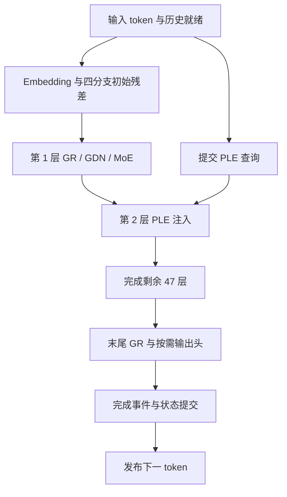
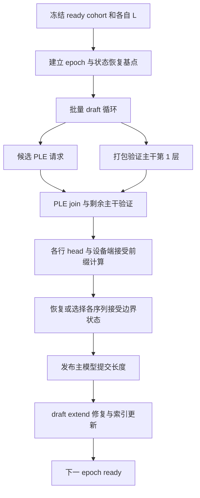

# 三份候选执行计划

2026-09-20 · 全部为 P（设计），容量计算为 D，性能为 H（待测）。
共同形状、位置和数值约定见 [MODEL_CONTRACT](MODEL_CONTRACT.md)。

## 0. 计划与 kernel 的关系

计划是有依赖的数据任务图。一个节点可映射为多个 kernel，多个节点也可
融合。初版用预分配 arena、CUDA events 和有限形状的 launch/graph
实现；专家动态任务探索 GPU descriptor 驱动的 grouped/persistent 路径。
不先要求全模型常驻一个 kernel，也不要求所有权重都进入片上存储。

host 负责准入、I/O、输出、超时与大粒度调度。目标是移除逐层路由/位置
回读；SSD 完成通知仍是合法 host 边界。图捕获以 PLE 消费边界拆段，
支持情况和动态 shape 成本需原型验证，不能把 cudaGraph 当自动优化。

## 1. 计划 D：单序列普通 decode

### 1.1 入口和出口

入口：状态覆盖 `[0,L)`，输入 `p=x_L` 已知，所有本轮资源已预留。
出口：主模型状态覆盖 `[0,L+1)`，输出下一 token `x_(L+1)`，它仍未被
消费；MTP 所需的最后 trunk 可按需交付。不输出完整词表 logits，
除非调用方明确请求 logits/logprobs。

### 1.2 数据时序



上图“剩余 47 层”包括第 2 层 PLE 后的子层。索引按用户可读的 1-based。
普通 decode 的未知未来 token 不能提前读取；本轮已知 p 的 PLE 可以
和第 1 层重叠。不要强制等待 I/O 后才开始 embedding。

| 阶段 | 读取 / 产出 | 驻留和释放 | 必须等待 |
|---|---|---|---|
| D0 准入 | p、位置、seq generation | host/device 控制页；本轮固定 arena | 上一提交完成 |
| D1 PLE fetch | 两个历史 token+p → 16 行 | 只读缓存→staging 双槽→device；消费后回收槽 | I/O event |
| D2 GRRead | R → x、四个 s | R 保留；norm/down/up 在子图结束前释放 | 当前 R 完整 |
| D3 GDN | x、conv、S → y、新状态 | 每 head/列 tile 在寄存器/shared；层结束写回 LPDDR | 本序列上一位置 |
| D3 QSA | x→Q/K/V/index；选择→attention | 微块 K/V 双缓冲，输出 FP32 累加；选择消费后释放 | 完整块和当前 tail 可见 |
| D4 GRWrite | R、s、y→R' | 优先原位或受控 ping-pong；下一读可复用缓存 | y 完成，R 所有旧读者完成 |
| D5 MoE | GRRead 后的 x→router→expert work/shared→y | 工作列表 GPU 生成；结果按 slot 汇合 | 选中专家与 shared 完成 |
| D6 Head | 最后 R→mixed→token | 词表 tile 局部最大值→全局归约 | 所有层完成 |
| D7 Commit | 新状态、next token | 发布 L+1 和完成事件 | 所有状态写入成功 |

每层执行 `GRRead→mixer→GRWrite→GRRead→MoE→GRWrite`。
MoE shared expert 与 routed experts 数学上可并行，但是否重叠由带宽
预算决定。两者同时饱和 LPDDR 时并发只会争用，不能假定更快。

### 1.3 D3-QSA：decode 专用切分

候选用 `query × kv_head × selected_block_partition` 网格；将一条
Selection 分给多个 CTA，每个 CTA 同时服务该 KV head 的 12 个 Q heads。
各分区产生 `(m_j,l_j,o_j)`：局部最大值、指数和、未归一化加权值。

```text
m = max_j(m_j)
l = sum_j(exp(m_j-m) * l_j)
o = sum_j(exp(m_j-m) * o_j) / l
```

空分区必须显式屏蔽，避免 `-inf - -inf`。输出 gate 在合并后应用。
分区数从实测选择；短 Selection 可能不分区更快。归约顺序变化纳入
数值模式，不能声称 bit-exact。不可通过减少 512 块预算获得“等价加速”。

### 1.4 D5-MoE：GPU 控制的数据任务

router → top-10/weights → 活跃专家描述符 → gate/up tiles →
SwiGLU+专家特定量化 → down tiles → 每 token 固定 slot 顺序 combine。

初版为 10 个 assignment 预留容量；批量推广为 `10*M`，避免为每专家
固定 M 个 token 的稀疏大表。按专家 prefix sum、tile task 数量和实际
padding 另计空间。跨 CTA producer/consumer 用 kernel 边界或正确的
release/acquire + completion 协议；禁止让未调度的 producer 被占满 SM
的自旋 consumer 永久阻塞。persistent 实验必须有资源进展证明。

### 1.5 边界和失败

本序列单步不可并发两次推进。普通 decode 初版不为所有状态保留故障
回滚副本：执行失败则标记该 sequence 无效，终止或从已知 token 历史
重建；不得仅回退 L 后继续使用部分更新的 recurrent state。
输出 buffer 有界；慢客户端通过准入/背压隔离，不阻塞其他 sequence
的 kernel 完成事件。EOS/长度上限在下一轮提交前检查。

## 2. 计划 P：长 prompt 分块 prefill

### 2.1 入口与循环顺序

入口：已知 prompt `[0,N)`，状态覆盖 `[0,L)`；首次 L=0。
选择 chunk 长度 C，执行 `[L,min(L+C,N))` 的全部 48 层后提交。
`C` 是内存与延迟预算参数，首轮候选 128/512/1024/2048/8192，
这些是实验点，不是已选定最优值。

采用 chunk-major：一个 chunk 走完所有层，再处理下一 chunk。
这样可以在完整状态边界让出执行权。代价是每 chunk 重新扫描各层权重；
不能同时宣称最小 workspace 和整篇 prompt 权重仅扫描一次。
layer-major 全 prompt 执行作为对照，不作为首个服务计划。

### 2.2 双槽与时间表

```text
host I/O：  PLE(chunk j) ── PLE(chunk j+1) ── ...
GPU：       chunk j 的层0 → PLE join → 层1..47 → 提交
                                                       ↓ 调度边界
GPU：                                      ready decode / 下一个 chunk
draft：     需要 MTP 时，消费已完成 chunk 的主干 trunk 并建立 draft cache
```

staging、device PLE 和 trunk 各自有最后消费者 event；“双缓冲”不代表
可以在 GPU 仍读槽时覆盖。prefetch 距离受页缓存/arena预算约束。

| 阶段 | 设计 |
|---|---|
| P0 准入 | 为 chunk 的 residual、最大子图 scratch、KV 增长和 I/O 槽一次预留 |
| P1 投影 | 对 C 行做 GEMM；权重在同一 tile 内服务多行 |
| P2 GR | 按 token tiles 做归一化、down+inject、up/read；按最后消费者复用 scratch |
| P3 GDN | chunk recurrence；长时间维用块算法候选，保留起止状态与短卷积边界 |
| P4 QSA | 建本 chunk raw KV；拼接前一尾块，压缩完整微块；逐 query causal 选择 |
| P5 QSA 选择 | 按 query tile × 历史块 tile 流式 score/top-k，禁止物化整篇 N×N/4 |
| P6 MoE | C 行路由后按专家聚合；以真实 M_e 分派 tile 并处理负载偏斜 |
| P7 Head | 普通 prefill 仅在最终 chunk 的最后 token 计算输出头 |
| P8 提交 | 全部主模型层达到相同 L'，发布长度后可切换请求 |

GDN 时间 chunk `Cg`、GR/GEMM token tile `Mt`、QSA query tile `Mq`
是独立参数，不强迫等于外层 C。非四倍数 C 必须正确处理 QSA tail。

### 2.3 QSA raw tail 的生命周期

从前一个已提交 chunk 保留 0..3 个 raw index keys。当前 chunk 中
足以组成四元组时，按原次序求和、除以 4、norm、RoPE，写压缩表。
当前 chunk 的 raw index keys 放临时区；压缩完成后只有末尾未完成组
继续存活。不能把两批分别 norm 后平均，也不能平均 RoPE 后的 keys。

prefill 内每个 query 只读取当时完整的微块。即使后台已计算了后面
微块的压缩 key，也要按 block end <= query position 过滤。
原始 core KV 始终按绝对位置保留，压缩的只是 index key。

### 2.4 MTP 初始化采用逐 chunk 消费 trunk

当前实现先保留全 prompt trunk，再执行 draft extend。候选方案在每个
主干 chunk 完成后，将 `h_i` 与 `x_(i+1)` 交付 draft extend：

- prompt 内部的 shifted token 已知，包含跨 chunk 的下一 token；
- 只有最后一个 prompt 位置需等待主模型 head 选出首个生成 token；
- draft cache 按 i 的顺序推进；消费完成后释放主干 chunk trunk；
- 最后 draft 行计算预测，产生下一轮 draft seed 与滚动 draft trunk。

这样保留 O(C) trunk，而不是 O(N)。主模型与 draft 共用带宽，初版
顺序消费；并发仅作为后续 H。如果 draft 落后，则背压或保留有界多槽，
不能无界累计主干输出，也不能丢失初始化所需的隐藏状态。

### 2.5 公平性和背压

调度器在 chunk 完成后检查 ready decode。设置最大连续 prefill 时间预算，
根据实测 chunk 时间选择 C；不在整个长 prompt 期间持有全局执行锁。
同一 sequence 的 chunk 不重入。不同请求的 arena/状态有独立所有权。
初版不在未完成的层之间抢占；细粒度抢占需要额外保存层游标和激活，另议。
prefix reuse、图像/视频 chunk 跨界先不实现，但接口保留 MRoPE 与视觉
输入位置，不用纯文本位置规则覆盖它们。

## 3. 计划 S：多序列 MTP

### 3.1 定义：避免错一位

本计划先限定 greedy。每个序列 b 的入口：

- 主模型已消费长度 L_b；pending token 为 p_b，位于 L_b。
- draft 已对齐当前前缀，能提供 k 个候选 d_1..d_k。
- 主模型验证输入 `[p_b,d_1,..,d_k]`，共 k+1 行。
- 验证输出 v_i 是验证行 i 预测的“下一个”token，i=0..k。
- 从 i=0 起比较 `v_i == d_(i+1)`，连续相等数量为 a_b，0<=a_b<=k。
- 提交消费的输入 `[p_b,d_1,..,d_a]`，长度推进 a_b+1。
- 下一 pending token 为 `v_a`；它此时尚未被主模型消费。

若 p_b 已在上一轮输出，本轮新输出 `[d_1,..,d_a,v_a]`，不重复输出 p_b。
发送游标与消费游标分别维护；实现也可延迟发送，但不得改变状态位置。

例：L=100、k=3、a=1，主模型验证位置 100..103，最终只提交位置
100 的 p 与 101 的 d1；L'=102，pending=v1，未接受位置不可见。

同一批两个异长序列的具体推演（k=3）：

| sequence | 入口 L | 验证位置 | 接受 a | 新 L | 下一 pending | 下一轮前的 index tail |
|---|---:|---|---:|---:|---|---|
| A | 100 | 100..103 | 1 | 102 | v1 | raw keys 100、101；验证时形成的块25无效 |
| B | 203 | 203..206 | 3 | 207 | v3 | raw keys 204、205、206；块50已完整提交 |

两者共享权重计算，但绝不共享可见长度、tail 或恢复点。A 必须清理
逻辑上不可见的块25，并恢复未完成 tail；B 可以保留验证最终状态。
下一批可以继续打包 A/B，但不能为了整齐把 A 的状态补推进到 B 的长度。

### 3.2 epoch 的任务图



主模型提交和 draft ready 是两个事件。主模型提交后 draft 修复失败，
可标记 draft 无效并回退普通 decode；不能拿旧 draft 状态继续推测。

### 3.3 各阶段的资源与控制

| 阶段 | 执行规则 |
|---|---|
| S0 cohort | 从 ready 队列选 B；记录真实 seq_id/generation，不能以 batch 行号寻址状态 |
| S1 reserve | 按 B、k、长度预留 verify、状态日志、PLE、draft extend；不足则减 B/k 或普通 decode |
| S2 draft | k 步有真实自回归依赖；步内跨 B 批量化，候选 token 留 GPU |
| S3 PLE | 可逐步提交候选查询或汇总一次，比较额外 I/O 与提前量；CPU I/O 需要的少量元数据允许回读 |
| S4 verify | dense/GEMM 按 M=B*(k+1) 打包；有状态算子按 sequence 的因果段执行 |
| S5 accept | GPU 计算 a_b、v_a 和每序列提交边界；只向 host 发布必要结果 |
| S6 restore | recurrent/conv 恢复；KV/index 用可见长度与版本排除拒绝后缀 |
| S7 extend | 将主干 h_(L+i) 与新 token x_(L+i+1) 配对，按 a_b+1 行/序列打包修复 draft |
| S8 ready | 释放 epoch 临时值、标记下一轮 ready、异步输出 |

extend 在主模型接受 a 个候选后消费的 shifted tokens 是
`[d_1,..,d_a,v_a]`，对应主干 verify rows `0..a`；a=0 时仍要处理
`(h_L,v_0)`。拒绝的 draft KV/index 后缀必须被遮蔽/重写。
packed token row 必须携带 seq_id、local_offset、绝对位置和 epoch。

### 3.4 初版恢复选择：完整 checkpoint

首个正确性原型保留起始 recurrent/conv 状态以及每个验证位置的边界。
接收 a 时选择处理过 a+1 个输入的状态；a=k 可用最终状态。
起始副本用于 epoch 取消，不能用仅有的“处理 p 后”快照代替。

KV 原始值可直接写预留后缀，提交由 visible_length 决定。index
压缩组如果跨越 epoch 起点，需要保存起点 raw tail；拒绝后从该 tail
和接受 token 重建末尾未完成组。不能只降低长度却保留被污染的 tail。
PLE conv、GDN conv、SSM 都是事务成员，不能只回滚 attention KV。
若 GPU 致命错误破坏恢复能力，则整个 sequence 失效并重建。

### 3.5 后续候选：秩一更新日志（H）

保存起始 S，一步记录 FP32 `(alpha,k,u)`，其中
`u=beta*(v-alpha*S_prev^T*k)`；从基点重放接受前缀恢复状态。
日志约 1.69 MiB/验证位置/序列（全部 36 层），完整 checkpoint 为
108 MiB。它节省中间快照写出，但增加基点存储、恢复读写和更新计算。
记录必须保持实际更新所用的精度和运算顺序；若融合/FMA 改变结果，
需按独立数值模式验证。不要逆推 S_prev，避免衰减和近奇异更新的误差放大。
conv 与 index tail 仍需自己的日志。全接受时可跳过 S 重放。

### 3.6 索引复用、调度与终止

draft Selection 可在一个 epoch 内复用，经验证的参考策略决定
capture 起点、新 token tail 和失效规则。第一版先逐步重算；复用作为
独立实验。主模型验证仍用每个位置自己的精确选择。

cohort 在 epoch 内固定，下一 epoch 重新从 ready 队列组批。初版 cohort
使用统一 k，按最小剩余上下文/输出预算限制；以后再测 ragged k。
在 pending 已发送的约定下，若本轮剩余可输出 token 数为 R、上下文
容量为 Ncap，则限制 `k+1 <= R` 且 `k+1 <= Ncap-L`；不足以容纳
至少一个候选时走普通 decode，或按终止策略结束，不越界验证。
不无限等待所有活跃请求；用有界等待窗平衡权重复用与尾延迟。
PLE 未就绪可以暂停该 cohort，未来隔离慢 sequence 需独立 arena，
不能重用当前仍在运行的 scratch。

输出遇 EOS/stop/max_tokens 时只发布有效前缀。请求关闭则回收整条
sequence，无需保存越过终止点的可继续状态；如需继续会话，必须明确
提交到实际保留的消费边界。取消输出与取消 GPU epoch 分开处理。
一般随机采样需要概率校正、RNG 状态和新的 acceptance 合同，暂不支持。
